# ShopEase - React TypeScript E-commerce App

ShopEase is a complete React TypeScript e-commerce web application built with **Vite**, **React Router DOM**, **Context API**, **useReducer**, **Bootstrap 5**, **custom responsive CSS**, **localStorage**, and a **JSON Server mock backend**.

The application supports user authentication, product catalog browsing, product search and filtering, cart management, checkout, mock payment flow, order placement, order history, order tracking, and reorder functionality.

---

## Table of Contents

- [Features](#features)
- [Tech Stack](#tech-stack)
- [Application Screenshots - Desktop](#application-screenshots---desktop)
- [Folder Structure](#folder-structure)
- [Architecture Overview](#architecture-overview)
- [Application Routes](#application-routes)
- [JSON Server API Endpoints](#json-server-api-endpoints)
- [Core Modules](#core-modules)
- [State Management](#state-management)
- [Validation Rules](#validation-rules)
- [Installation and Setup](#installation-and-setup)
- [Run Commands](#run-commands)
- [Default Login Credentials](#default-login-credentials)
- [Screenshot Capture Script](#screenshot-capture-script)
- [Testing Checklist](#testing-checklist)
- [Common Issues and Fixes](#common-issues-and-fixes)
- [Future Enhancements](#future-enhancements)
- [Project Status](#project-status)

---

## Features

### Authentication

- Register a new user with name, email, password, mobile number, and address.
- Login existing users using email and password.
- Logout functionality.
- Profile page for logged-in users.
- Protected routes for profile, cart, checkout, order success, and order history.
- Current logged-in user persisted using localStorage.
- User validation through JSON Server.
- Form validation for required fields, invalid email, password length, mobile number, and address.

### Product Catalog

- Product listing page.
- Product details page.
- Category-based product pages.
- Product search by product name, category, and brand.
- Product filtering by category, brand, price range, and rating.
- Responsive product card grid.
- Product discount, rating, and stock badges.
- Add to cart functionality.
- Out-of-stock product handling.

### Shopping Cart

- Add product to cart.
- Increase item quantity.
- Decrease item quantity.
- Remove cart item.
- Clear cart.
- Cart item count in navbar.
- Cart subtotal and total amount calculation.
- useReducer-based cart state management.
- Cart persisted using localStorage.

### Checkout

- Delivery address form.
- Payment method selection.
- Mock Credit Card payment fields.
- Mock UPI payment field.
- Cash on Delivery option.
- Checkout validation.
- Order creation using JSON Server.
- Cart clearing after successful order.
- Redirect to order success page.

### Orders

- Order success page.
- Order history page.
- Order tracking timeline.
- Previous order reorder functionality.
- Orders stored in JSON Server.

### UI and Responsiveness

- Bootstrap 5 responsive layout.
- Custom professional CSS.
- Responsive navbar.
- Product grid layout.
- Sidebar filters on desktop.
- Mobile-friendly stacked layout.
- Modern cards, buttons, forms, shadows, spacing, and border radius.
- Dashboard-like sections for profile, cart, checkout, and orders.

---

## Tech Stack

- React
- TypeScript
- Vite
- React Router DOM
- Context API
- useReducer
- Bootstrap 5
- Bootstrap Icons
- JSON Server
- localStorage
- Custom CSS
- Puppeteer for automated screenshot capture

---

## Application Screenshots - Desktop

> Desktop screenshots are expected inside the `screenshots/` folder. Generate them using `npm run screenshots` before publishing the README.

### 1. Home Dashboard

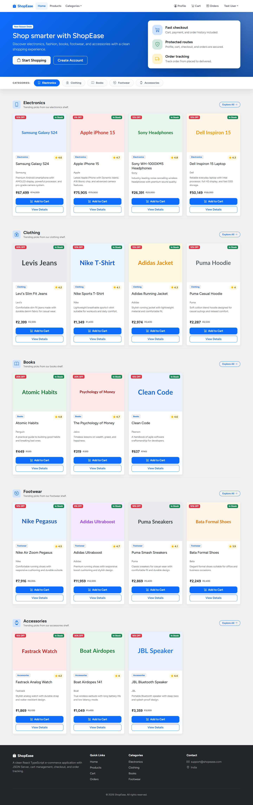

### 2. Identity Verification and Onboarding

#### Account Creation

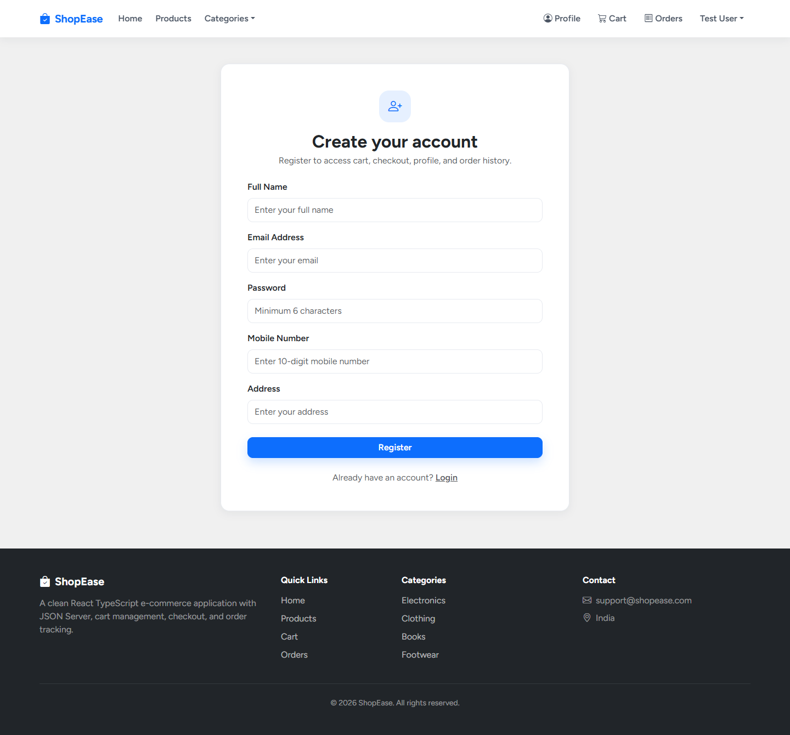

#### Secure Authentication

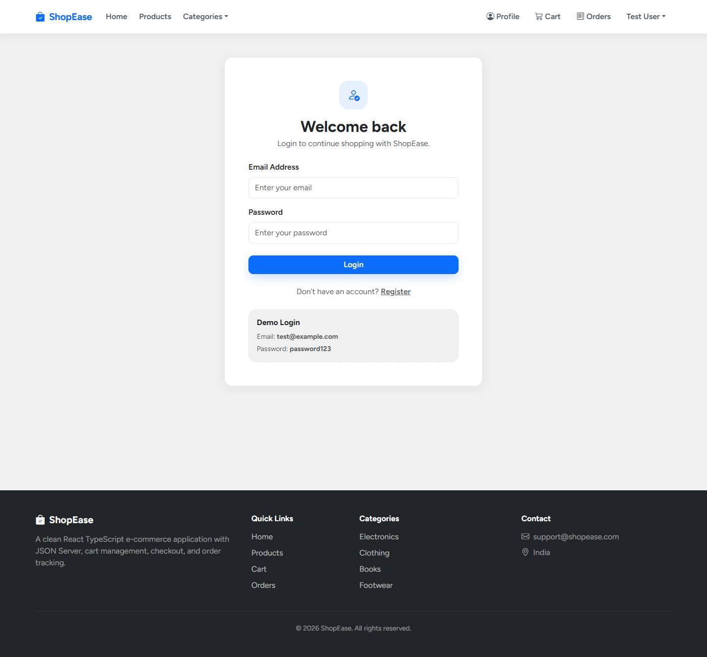

### 3. Product Discovery Catalog and Product Details

#### Product Listing

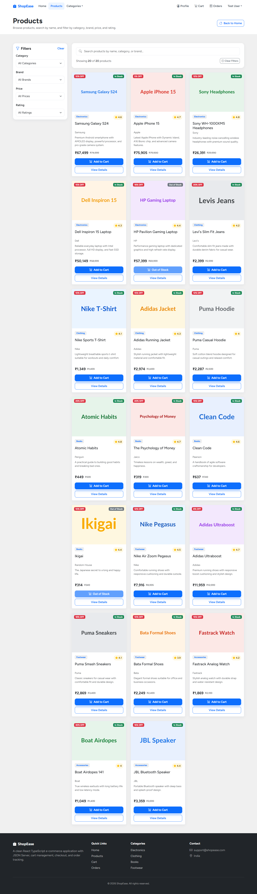

#### Product Details

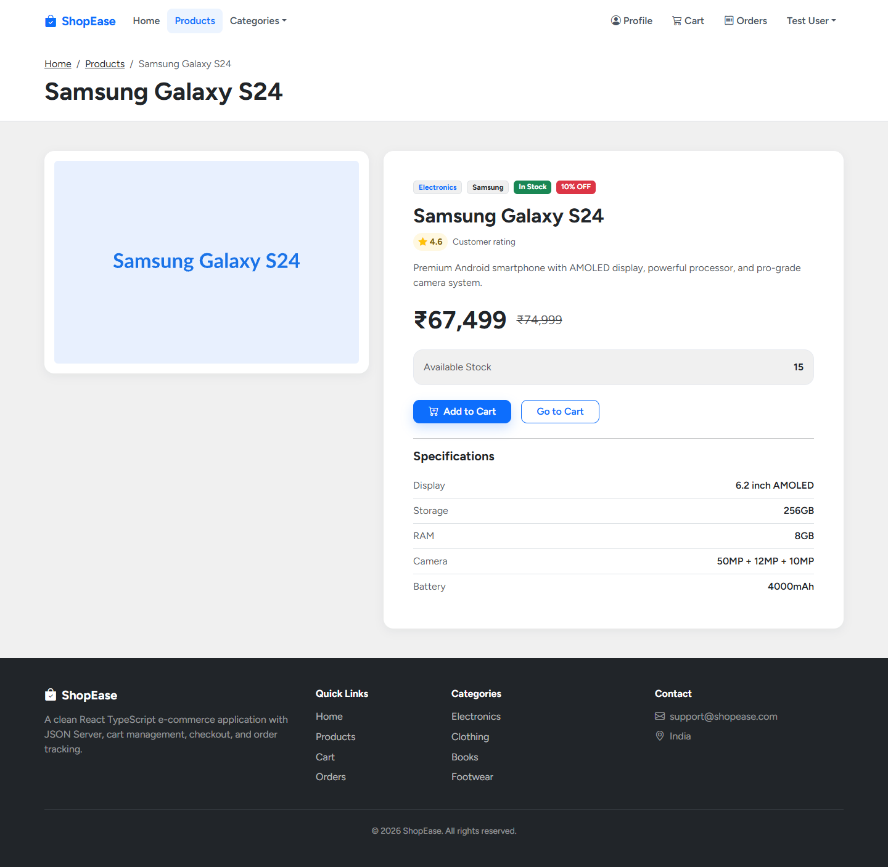

#### Category Specific View

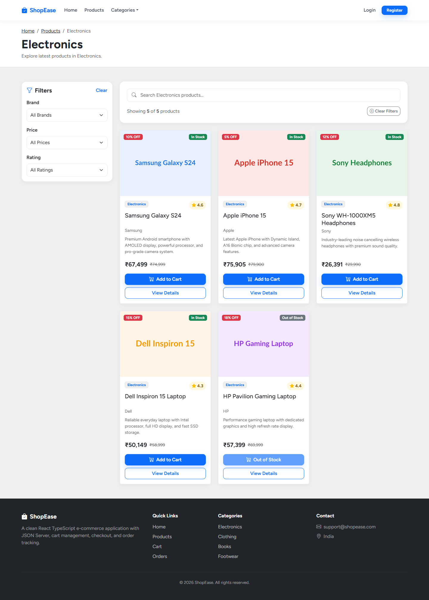

### 4. Cart Processing and Checkout

#### Active Cart Line Items

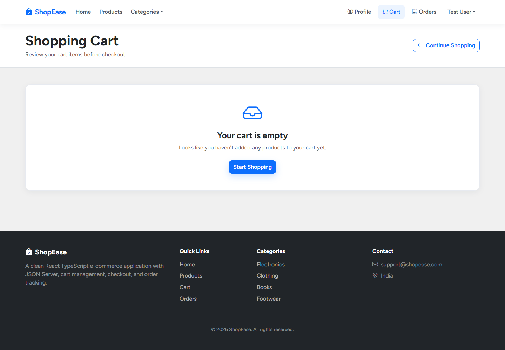

#### Checkout and Payment Method Selection

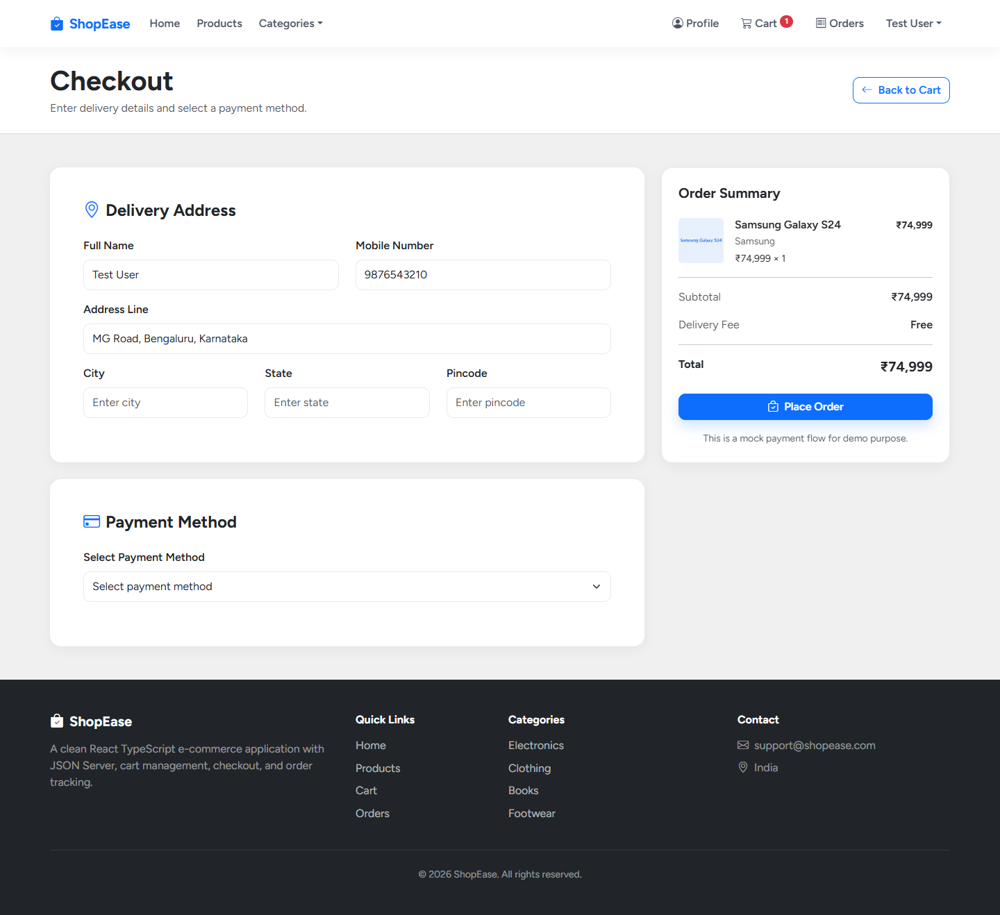

### 5. User Profile and Order History

#### User Profile

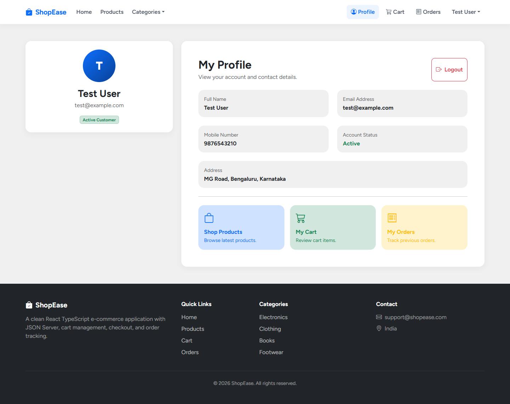

#### Order History and Tracking

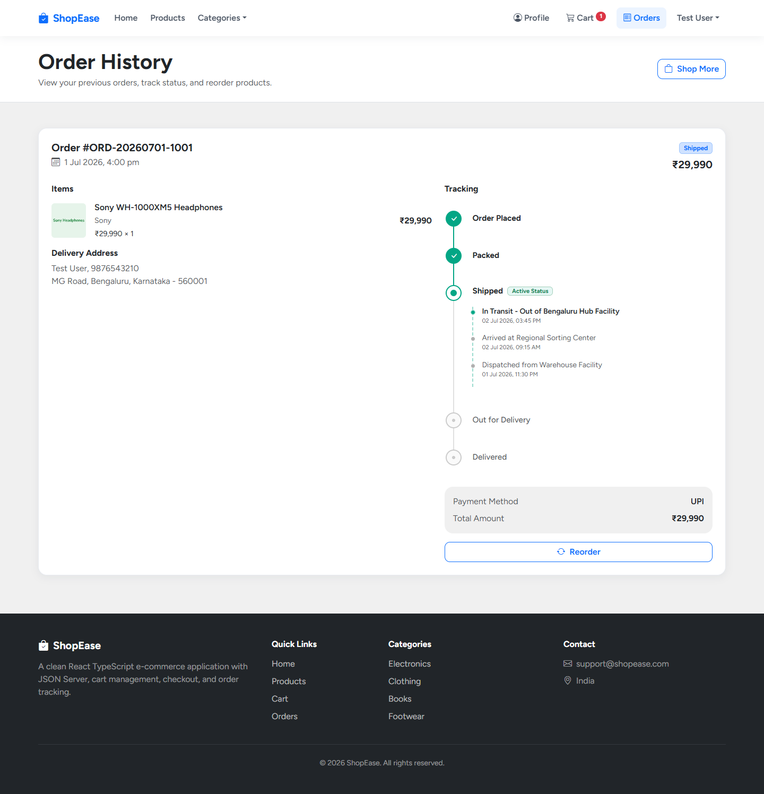

### 6. Fallback Route

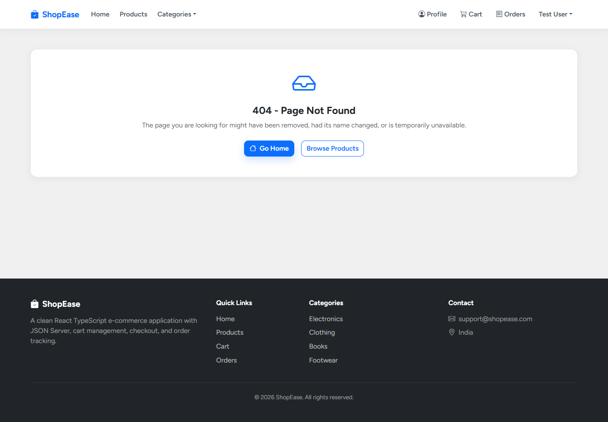

---

## Folder Structure

```txt
react-ecommerce-app/
  db.json
  package.json
  README.md

  screenshots/
    home-desktop.png
    login-desktop.png
    register-desktop.png
    products-desktop.png
    electronics-category-desktop.png
    product-details-desktop.png
    profile-desktop.png
    cart-desktop.png
    checkout-desktop.png
    orders-desktop.png
    not-found-desktop.png

  scripts/
    capture-screenshots.ts

  src/
    components/
      common/
        Button.tsx
        EmptyState.tsx
        FormInput.tsx
        Loader.tsx

      layout/
        Footer.tsx
        Navbar.tsx

      products/
        ProductCard.tsx
        ProductFilter.tsx
        SearchBar.tsx

      cart/
        CartItem.tsx

      orders/
        OrderCard.tsx
        OrderTrackingTimeline.tsx

    context/
      AuthProvider.tsx
      CartProvider.tsx
      AuthContextObject.ts
      CartContextObject.ts
      useAuth.ts
      useCart.ts

    hooks/
      useLocalStorage.ts

    pages/
      HomePage.tsx
      LoginPage.tsx
      RegisterPage.tsx
      ProfilePage.tsx
      ProductListPage.tsx
      ProductDetailsPage.tsx
      CategoryPage.tsx
      CartPage.tsx
      CheckoutPage.tsx
      OrderSuccessPage.tsx
      OrderHistoryPage.tsx
      NotFoundPage.tsx

    routes/
      AppRoutes.tsx
      ProtectedRoute.tsx

    services/
      apiClient.ts
      authService.ts
      productService.ts
      orderService.ts

    types/
      api.ts
      auth.ts
      cart.ts
      order.ts
      product.ts

    utils/
      currencyFormatter.ts
      orderUtils.ts
      storage.ts
      validation.ts

    App.tsx
    main.tsx
    index.css
```

---

## Architecture Overview

```txt
React Components and Pages
        ↓
Context Providers and Custom Hooks
        ↓
Service Layer
        ↓
apiClient.ts fetch wrapper
        ↓
JSON Server API / db.json
```

### Persistence Strategy

```txt
localStorage:
  ecommerce_current_user
  ecommerce_cart_items

JSON Server:
  products
  users
  orders
```

---

## Application Routes

```txt
/                       Home page
/login                  Login page
/register               Register page
/profile                Protected profile page
/products               Product listing page
/products/:id           Product details page
/categories/:category   Category product page
/cart                   Protected cart page
/checkout               Protected checkout page
/order-success/:orderId Protected order success page
/orders                 Protected order history page
/*                      Not found page
```

---

## JSON Server API Endpoints

### Products

```txt
GET /products
GET /products/:id
GET /products?category=Electronics
```

### Users

```txt
GET /users
GET /users?email=test@example.com
POST /users
```

### Orders Types

```txt
GET /orders
GET /orders?userId=user-001
GET /orders?orderId=ORD-20260701-1001
POST /orders
PATCH /orders/:id
```

---

## Core Modules

### Authentication Module

Authentication is handled using `AuthProvider`, `AuthContextObject`, and `useAuth`.

Responsibilities:

- Load current user from localStorage.
- Register user using JSON Server.
- Validate duplicate email before registration.
- Login user using email and password.
- Save current user to localStorage.
- Logout by clearing current user from localStorage.

### Product Module

Product data is fetched from JSON Server using `productService`.

Responsibilities:

- Fetch all products.
- Fetch product by ID.
- Fetch products by category.
- Support product listing, details, and category pages.
- Support search and filter combinations.

### Cart Module

Cart state is handled using `CartProvider`, `CartContextObject`, and `useCart`.

Reducer actions:

```txt
ADD_TO_CART
REMOVE_FROM_CART
INCREASE_QUANTITY
DECREASE_QUANTITY
CLEAR_CART
RESTORE_CART
```

Cart rules:

- Existing product quantity increases instead of creating duplicates.
- Quantity cannot go below 1.
- Quantity cannot exceed product stock.
- Cart items are persisted in localStorage.

### Checkout Module

Checkout page handles delivery address, payment method, order summary, and order creation.

Supported payment methods:

- Credit Card
- UPI
- Cash on Delivery

On successful order placement:

- Unique order ID is generated.
- Order is saved to JSON Server.
- Cart is cleared.
- User is redirected to `/order-success/:orderId`.

### Order Module

Order history is fetched by current user ID.

Order features:

- View previous orders.
- View tracking timeline.
- View delivery address and payment method.
- Reorder products into cart.

---

## State Management

| State | Managed By | Persistence |

| Current user | AuthProvider | localStorage |
| Cart items | CartProvider + useReducer | localStorage |
| Products | Page state + productService | JSON Server |
| Orders | Page state + orderService | JSON Server |
| Form state | Page-level useState | Not persisted |

---

## Validation Rules

Validation is handled in `src/utils/validation.ts`.

Rules include:

- Required field validation.
- Valid email format.
- Password minimum 6 characters.
- Valid 10-digit Indian mobile number.
- Valid 6-digit Indian pincode.
- Valid 16-digit card number.
- Valid 3 or 4 digit CVV.
- Valid UPI ID format.
- Payment-specific validation for Credit Card and UPI.

---

## Installation and Setup

Create the project:

```bash
npm create vite@latest react-ecommerce-app -- --template react-ts
```

Go to project folder:

```bash
cd react-ecommerce-app
```

Install dependencies:

```bash
npm install
```

Install app dependencies:

```bash
npm install react-router-dom bootstrap bootstrap-icons
```

Install development dependencies:

```bash
npm install -D json-server concurrently puppeteer tsx
```

---

## Run Commands

Start JSON Server only:

```bash
npm run server
```

Start Vite only:

```bash
npm run dev
```

Start JSON Server and React app together:

```bash
npm run start
```

Build production bundle:

```bash
npm run build
```

Preview production build:

```bash
npm run preview
```

Capture screenshots:

```bash
npm run screenshots
```

---

## package.json Scripts

```json
{
  "scripts": {
    "dev": "vite",
    "server": "json-server --watch db.json --port 4000",
    "start": "concurrently \"npm run server\" \"npm run dev\"",
    "build": "tsc -b && vite build",
    "preview": "vite preview",
    "screenshots": "tsx scripts/capture-screenshots.ts"
  }
}
```

---

## Default Login Credentials

```txt
Email: test@example.com
Password: password123
```

---

## Screenshot Capture Script

Desktop screenshots are generated into the `screenshots/` folder using Puppeteer.

Expected desktop screenshot files:

```txt
screenshots/home-desktop.png
screenshots/login-desktop.png
screenshots/register-desktop.png
screenshots/products-desktop.png
screenshots/electronics-category-desktop.png
screenshots/product-details-desktop.png
screenshots/profile-desktop.png
screenshots/cart-desktop.png
screenshots/checkout-desktop.png
screenshots/orders-desktop.png
screenshots/not-found-desktop.png
```

Run screenshot capture:

```bash
npm run screenshots
```

If the app runs on a different port:

```powershell
$env:APP_BASE_URL="http://localhost:5174"; npm run screenshots
```

### Puppeteer Timeout Compatibility Fix

If Puppeteer shows this error:

```txt
Property 'waitForTimeout' does not exist on type 'Page'
```

Use a native delay helper instead:

```ts
const delay = (milliseconds: number): Promise<void> => {
  return new Promise((resolve) => {
    setTimeout(resolve, milliseconds);
  });
};

await delay(500);
```

---

## Testing Checklist

### Product Catalog Server

- Products load from JSON Server.
- Product images display correctly.
- Search by product name.
- Search by brand.
- Search by category.
- Filter by category.
- Filter by brand.
- Filter by price.
- Filter by rating.
- Clear filters.
- View product details.
- Out-of-stock Add to Cart button is disabled.

### Cart

- Add product to cart.
- Add same product again and verify quantity increment.
- Increase quantity.
- Decrease quantity.
- Quantity does not go below 1.
- Quantity does not exceed stock.
- Remove cart item.
- Clear cart.
- Verify cart count in navbar.
- Verify cart persists after refresh.

### Checkout Pages

- Checkout page loads with cart items.
- Validate delivery address required fields.
- Validate mobile number.
- Validate pincode.
- Select Credit Card and validate card fields.
- Select UPI and validate UPI field.
- Select Cash on Delivery.
- Place order successfully.
- Verify cart clears after order.
- Verify redirect to order success page.

### Orders Pages

- View order success page.
- View order history.
- Verify order tracking timeline.
- Verify delivery address.
- Verify payment method.
- Reorder products.
- Verify reordered items are added to cart.

### Responsive UI

- Validate desktop layout.
- Validate tablet layout.
- Validate mobile layout.
- Validate navbar collapse.
- Validate product cards on mobile.
- Validate checkout form on mobile.
- Validate order cards on mobile.

---

## Common Issues and Fixes

### JSON Server Not Running

If products, login, or orders do not load, start JSON Server:

```bash
npm run server
```

### Bootstrap Dropdown Not Working

Ensure this import exists in `src/main.tsx`:

```tsx
import "bootstrap/dist/js/bootstrap.bundle.min.js";
```

### Images Showing as URL Text

Incorrect:

```tsx
{product.image}
```

Correct:

```tsx

```

For cart, checkout, and order rows:

```tsx

```

### Dynamic Form Value Not Updating

Incorrect:

```tsx
setValues((previousValues) => ({
  ...previousValues,
  value
}));
```

Correct:

```tsx
setValues((previousValues) => ({
  ...previousValues,
  [fieldName]: value
}));
```

For nested delivery address fields:

```tsx
setValues((previousValues) => ({
  ...previousValues,
  deliveryAddress: {
    ...previousValues.deliveryAddress,
    [fieldName]: value
  }
}));
```

### Windows Context Import Conflict

Avoid files that differ only by case, such as:

```txt
AuthContext.tsx
authContext.ts
```

Recommended naming:

```txt
AuthProvider.tsx
AuthContextObject.ts
CartProvider.tsx
CartContextObject.ts
```

---

## Future Enhancements

- Admin dashboard for product management.
- Admin dashboard for order status updates.
- Product sorting and pagination.
- Wishlist feature.
- Product reviews and ratings.
- Coupon code support.
- Real authentication with JWT.
- Payment gateway integration.
- Backend API using Node.js, Java Spring Boot, or .NET.
- Inventory management.
- Dark mode.
- Unit tests with Vitest.
- E2E tests with Playwright.
- Docker deployment.
- CI/CD pipeline using GitHub Actions.

---

## Project Status

This project includes:

- React TypeScript frontend.
- JSON Server mock backend.
- Authentication flow.
- Product catalog.
- Search and filters.
- Cart management.
- Checkout workflow.
- Order history.
- Order tracking.
- Reorder functionality.
- Desktop screenshots in README.
- Responsive Bootstrap plus custom CSS UI.
